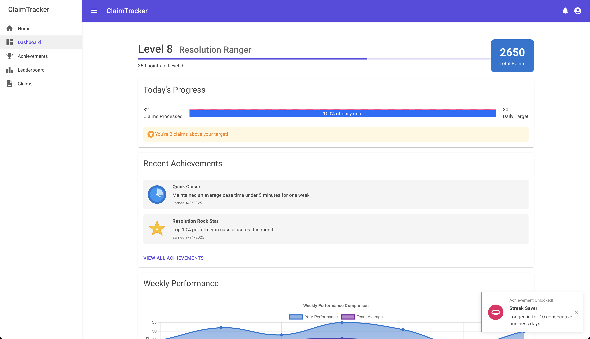

# Demo Claim Tracker

A functional prototype demonstrating gamification/interactive concepts for case management applications built with Blazor.

## Overview

This prototype demonstrates an integrated interactive approach for a claims processing application. It showcases how engagement-driving features can be seamlessly incorporated into an enterprise workflow application without sacrificing professional appearance or functionality.

### Key Features

- **Real-time achievement notifications** with strategic timing to minimize distraction
- **Progressive point system** that rewards both quantity and quality metrics
- **Customizable badges** to recognize different work styles and strengths
- **Performance visualization** with both personal and team-based views
- **Accessible design** following WCAG 2.1 AA standards with ARIA support

## Screenshot

### Dashboard with Gamification Elements

*The main dashboard showing productivity metrics, achievement progress, and daily goals with gamification elements carefully integrated into the professional interface.*

## Technical Highlights

### 1. Accessibility-First Design
All gamification elements are fully accessible, with:
- ARIA attributes for screen reader compatibility
- Keyboard navigation for all interactive elements
- High contrast mode compatibility
- Animation controls for users with motion sensitivity

### 2. Performance Optimization
- Lazy-loaded gamification components to maintain core application speed
- Efficient state management to prevent UI freezing during animations
- Throttled notification system to prevent overwhelming users

### 3. Blazor Integration
- Custom Blazor components for all gamification elements
- Clean separation between business logic and gamification features
- SignalR integration for real-time updates without page refreshes

### 4. JavaScript Interoperability
- Smooth animations using Lottie.js integrated via JS Interop
- Chart.js implementation for performance visualization

## Design Considerations

### Balanced Approach

This prototype demonstrates a balanced approach to gamification that:
1. **Motivates without manipulating** - Encourages productivity through positive reinforcement rather than negative pressure
2. **Personalizes without exposing** - Tailors experiences to individual work patterns while respecting privacy
3. **Celebrates without interrupting** - Acknowledges achievements without disrupting workflow

### Measured Approach

The system tracks multiple dimensions of performance:
- **Efficiency metrics** - Cases closed per hour, average handling time
- **Quality indicators** - Error rates, review scores, customer satisfaction
- **Collaboration measures** - Assistance provided to colleagues, knowledge sharing
- **Consistency tracking** - Sustained performance over time rather than just peaks

## Future Expansion Possibilities

- **Machine learning integration** for personalized challenge calibration
- **Team-based challenges** with collaborative rewards
- **Wellness integration** to encourage healthy work patterns
- **Virtual economy** for converting points to workplace benefits

## Technical Stack

- MudBlazor component library for UI elements
- SignalR for real-time notifications
- LocalStorage for client-side state persistence
- ApexCharts.Blazor for data visualization
- Custom animation system using JS Interop

## Accessibility Compliance

This prototype adheres to:
- WCAG 2.1 Level AA standards
- Section 508 requirements
- ARIA 1.1 best practices

All gamification elements include appropriate ARIA roles, states, and properties to ensure users of assistive technologies can fully participate in the gamified experience.